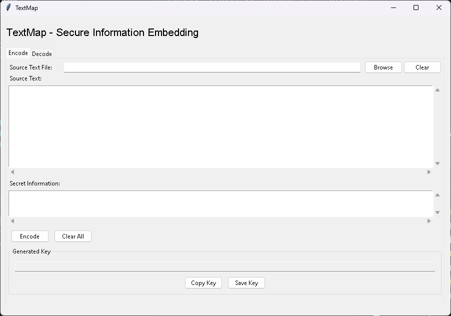

# TextMap

TextMap is a security tool that lets you hide sensitive information within ordinary text, making it ideal for safely storing cryptocurrency mnemonic phrases, passwords, or other secrets in digital format. What makes it unique is that both the encoded text and the key can be safely shared or stored independently in public - for example, you can post the encoded text on social media and share the key through a different channel. As long as no one can associate which key belongs to which text, your secret remains secure.

## What Makes It Special

- **Safe Public Sharing**: Both components (encoded text and key) can be safely shared in public on their own:
  - The encoded text looks like normal text and can be posted anywhere online
  - The key can be shared through any channel without risk
  - Security is maintained as long as the components aren't associated
- **Steganographic Security**: Instead of traditional encryption, TextMap hides your secret information within regular text, making it non-obvious that any secret exists
- **Two-Factor Security**: Requires both the encoded text AND a separate key to recover your secret
- **Format Preservation**: The encoded text remains readable and looks like normal text
- **Quantum-Resilient Design**: Does not rely on traditional cryptographic algorithms that might be vulnerable to quantum computing
- **Minimal Dependencies**: Uses only essential libraries for maximum security and auditability

## Perfect For

- **Cryptocurrency Security**: Safely store mnemonic phrases digitally
- **Password Management**: Store master passwords
- **Sensitive Information**: Hide any sensitive text within innocent-looking documents
- **Digital Dead Man's Switch**: Split the key and text between different parties/locations

## Installation

```bash
# Clone the repository
git clone https://github.com/yourusername/textmap.git
cd textmap

# Install
pip install .
```

## How to Use

### Command Line Interface

```bash
# Encode your secret
textmap encode --text-file source.txt --mnemonic "your secret phrase" --output encoded.txt --key-file key.txt

# Using pipes
echo "This is my source text" | textmap encode --mnemonic "secret" > encoded.txt

# Decode later
textmap decode --text-file encoded.txt --key "your-key" --output decoded.txt
```

### GUI Interface

Simply launch the GUI with:

```bash
textmap --gui
```



### Python API

```python
from textmap import MnemonicEncoder

# Create encoder
encoder = MnemonicEncoder()

# Encode your secret
source_text = "Your innocent-looking source text here..."
secret = "Your sensitive information here"
encoded_text, key = encoder.encode(secret, text)

# Later, decode
decoded = encoder.decode(encoded_text, key)
```

## Security Model

TextMap uses a unique security approach different from traditional encryption:

1. **Information Hiding**: Your secret is hidden within normal text using character mapping
2. **Key Generation**: A secure random key maps your secret to specific positions in the text
3. **Character Offsets**: Each character of your secret is encoded as an offset from characters in the source text

### Security Properties

- **Two Components**: Both the encoded text AND the key are required to recover the secret
- **Independent Component Security**: Each component (encoded text and key) can be safely shared or stored independently:
  - The encoded text looks like normal text and can be shared publicly
  - The key can be shared through different channels without risk
  - Security is maintained as long as no one can associate which key goes with which text
- **No Password Cracking**: Unlike password-based encryption, there's nothing to "crack"
- **Quantum Safety**: Doesn't rely on traditional cryptographic algorithms that might be vulnerable to quantum computers
- **Plausible Deniability**: Unlike encrypted files that are clearly encrypted, encoded text appears as natural readable text, making it impossible to prove that it contains hidden information

### Technical Details

#### Character Set and Encoding
- Supports ASCII alphanumeric characters (a-z, A-Z, 0-9)
- Basic punctuation (.,!?)
- Whitespace (space, tab, newline)
- All text is processed as UTF-8
- Invalid characters are automatically replaced with spaces

#### Text Requirements
- Minimum 100 non-whitespace characters in source text
- At least 20 unique characters
- Must contain both uppercase and lowercase letters
- No single character should appear more than 30% of the time
- Longer texts provide better security

#### Key Format
Keys are structured as: `v1-[length]-[main_key]-[offsets]`
- Version identifier (v1)
- Encoded text length in hex
- Main key for position mapping
- Character offset values

### Best Practices

1. **Source Text Selection**
   - Use text at least 3x longer than your secret
   - Choose text with good character variety
   - Prefer longer, natural-looking text
   - Never reuse the same source text for multiple secrets

2. **Storage and Sharing**
   - Never store or share the key alongside its corresponding encoded text
   - The encoded text can be safely stored/shared publicly (e.g., in emails, documents, social media)
   - The key can be shared through separate channels (e.g., password manager, secure messaging)
   - Ensure there's no obvious way to link which key belongs to which text
   - Consider splitting key storage:
     - Part in password manager
     - Part in secure physical location
     - Part with trusted contacts

3. **Usage Tips**
   - Test decoding immediately after encoding
   - Keep multiple backups of both components
   - Consider encoding the same secret in multiple texts

### Common Issues and Troubleshooting

1. **Invalid Source Text**
   - Error: "Text is not suitable for encoding"
   - Solution: Choose longer text with more character variety
   - Ensure mix of upper and lowercase letters

2. **Key Validation Errors**
   - "Invalid key format": Check key structure
   - "Positions exceed text length": Source text too short
   - "Failed to decode": Key doesn't match encoded text

3. **File Access Issues**
   - Ensure proper file permissions
   - Check UTF-8 encoding compatibility
   - Verify file paths are correct

### Security Limitations

- The length of your secret is visible in the key
- Source text should not be reused for multiple secrets
- Very short or repetitive source texts might be unsuitable
- Character set is limited to basic ASCII

## Example Use Case: Storing a Crypto Mnemonic

1. Find a suitable source text (e.g., a public domain book excerpt, an online article or any persistent text that you can access in the future)
2. Encode your mnemonic phrase:
   ```bash
   textmap encode --text-file book.txt --mnemonic "word1 word2 ... word24" --output encoded.txt --key-file key.txt
   ```
3. Store the key securely (e.g., split between password manager and physical safe)
4. Store the encoded text file anywhere (it just looks like normal text)
5. To recover: combine the key and encoded text using TextMap

## Dependencies

TextMap maintains minimal dependencies for security:
- typing-extensions >= 4.0.0: Type hint support
- chardet >= 4.0.0: Character encoding detection